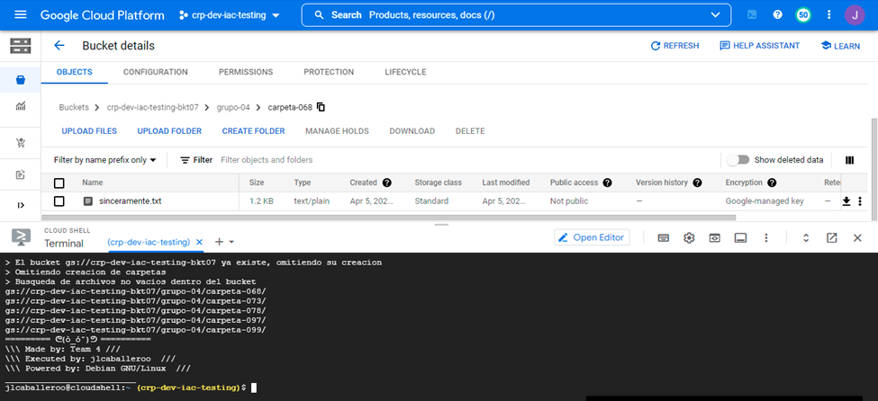
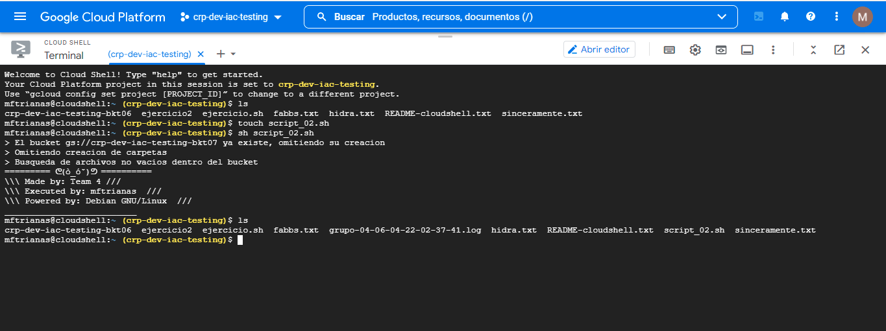
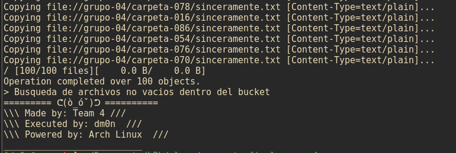
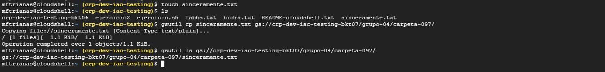

# Proyecto Final Grupo 4

### 1. Tabla de Participantes

| Nombre                 | Aportación                     |
|------------------------|--------------------------------|
| José Luis Caballero    |  |
| Amairani Hernández     |          |
| Maribel Fabiola Triana |    |
| Diana Lilia Rojas      |    |
| Juan Carlos González   |                |
| Aarón Hernández  |       |      
| David Fabián Monjaraz  | Mente maestra | 
| Emmeline Enríquez      |                 |

## 2. Evidencias

